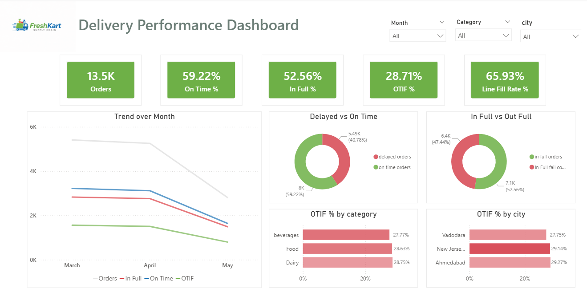

# 📦 Supply Chain Delivery Performance Analysis (OTIF)

> 🚀 Improving delivery efficiency by analyzing delays, stock-outs, and fulfillment gaps

---

## ⚡(Quick Summary)

- 📉 OTIF performance dropped to **~28.7%**
- ⏱️ ~41% orders are **delayed**
- 📦 Only ~52% orders are delivered **in-full**
- ⚠️ Stock-outs in high-demand products (Ghee, Butter, Biscuits)
- 💡 Logistics inefficiencies + inventory gaps identified as key drivers

---

## 📌 Business Problem
FreshKart Supply Chain Pvt Ltd is facing poor delivery performance, resulting in low customer satisfaction and operational inefficiencies. Issues include delayed deliveries, partial fulfillment, and declining OTIF metrics.

---

## 🎯 Objective
- Analyze delivery performance (OTIF, delays, fill rate)  
- Identify root causes of delays and partial deliveries  
- Provide actionable recommendations to improve efficiency  

---

## 🧠 Approach
✔ Data Cleaning & Validation  
✔ Exploratory Data Analysis (EDA)  
✔ KPI Analysis (OTIF, On-Time %, Fill Rate)  
✔ City, Product & Order-Level Analysis  
✔ Power BI Dashboard  

---

## 📊 Key Insights

- 🔴 **OTIF is critically low (~28.7%)**
- 🔴 **41% of orders are delayed**
- 🔴 **Only ~52% orders are fulfilled in-full**
- 🔴 High-demand products (Ghee, Butter, Biscuits) face frequent stock-outs  
- 🟡 Vadodara shows highest delivery delays  
- 🟡 Performance declining month-over-month (March → May)  

---

## ⚠️ Key Business Gaps

- ❌ Inefficient last-mile delivery operations  
- ❌ Poor inventory planning for high-demand products  
- ❌ Lack of focus on high-delay cities  
- ❌ No proactive performance monitoring  

---

## 💡 Recommendations

- ✅ Optimize delivery routes and implement real-time tracking  
- ✅ Maintain safety stock for high-demand products  
- ✅ Improve demand forecasting and replenishment planning  
- ✅ Focus on high-delay cities (e.g., Vadodara)  
- ✅ Introduce weekly KPI monitoring and performance reviews  

---

## 📈 Business Impact (Expected)

- 📉 Improved OTIF performance  
- 📦 Reduction in partial deliveries  
- ⏱️ Faster and more reliable deliveries  
- 😊 Increased customer satisfaction  

---

## 📊 Dashboard Preview

  

---

🛠 Tech Stack

📊 Excel

📈 Power BI

🗄️ SQL

---

## 🚀 Conclusion

Delivery inefficiencies are driven by **logistics delays and inventory shortages**. Addressing these through better planning and monitoring can significantly improve OTIF and overall operational performance.

---
